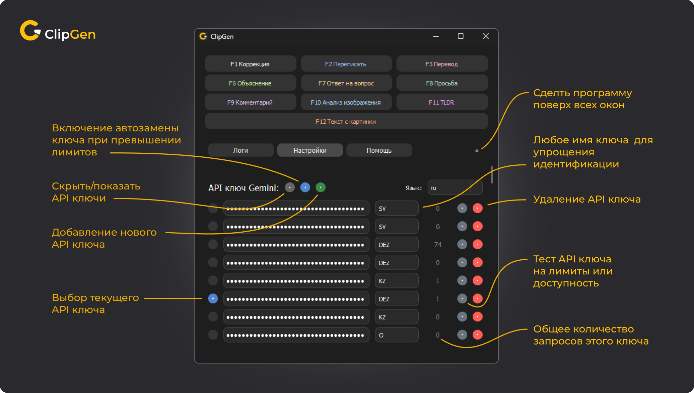
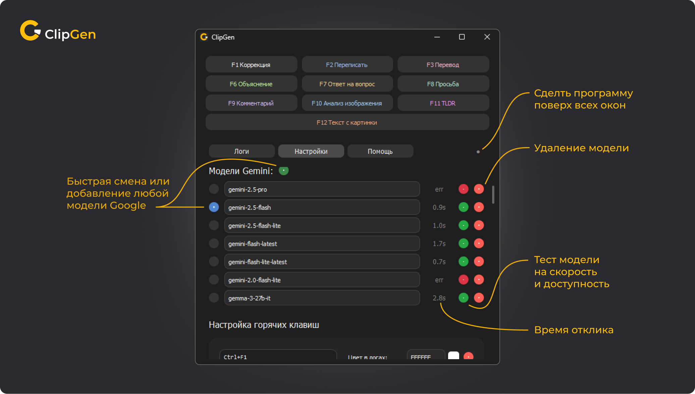

# ClipGen

**ClipGen** — это полезный инструмент для автоматизации рутинных запросов к ИИ через буфер обмена. Это не очередной чат-бот, с которым нужно вести диалог. Это утилита, которая позволяет внедрить мощь нейросетей (Google Gemini, OpenAI, DeepSeek, Claude) в **любое приложение** Windows без переключения окон.

Больше не нужно нажимать `Alt+Tab`, открывать браузер, заходить в веб-интерфейсы, вставлять текст, писать промпт и копировать ответ обратно. С ClipGen вы просто нажимаете горячую клавишу — и магия происходит прямо там, где вы работаете.

## Зачем это нужно?

### Ноль переключений контекста

[](https://www.youtube.com/watch?v=Qc-eO0ArJ24)

Выделили непонятный термин в статье? Нажали `Ctrl+F6` — через секунду объяснение уже в логах программы. Пишете код в IDE и нужна документация к функции? Один хоткей — и комментарий готов. Вы не теряете фокус и не отвлекаетесь на браузер.

### Генерация контента на лету (Figma, Word, Telegram)

Нужен редкий символ или эмодзи? Не ищите его в интернете.

* **Пример:** Напишите в Figma текст «эмодзи флаг Кирибати».
* **Действие:** Нажмите `Ctrl+F8` (Просьба).
* **Результат:** Текст мгновенно превратится в 🇰🇮.
  Удобно для дизайнеров, редакторов и всех, кто ценит скорость.

### Поддержка разных провайдеров

Программа работает с **Google Gemini** и **OpenAI-совместимыми** API:
* **ChatGPT** (GPT-4o, GPT-3.5)
* **OpenRouter** (доступ к Claude 3.5 Sonnet, DeepSeek, Llama 3 и другим моделям)
* Любые другие локальные или облачные API, совместимые с форматом OpenAI.

### Индивидуальная модель для каждого хоткея

Теперь можно назначить **разные модели** для разных действий:
* `Ctrl+F1` — быстрая коррекция через Gemini Flash
* `Ctrl+F2` — качественный перевод через GPT-4o
* `Ctrl+F3` — анализ кода через Claude Sonnet

Каждый хоткей может использовать свой провайдер и модель независимо от глобальных настроек.

### Режим обучения (Новое в v2.3.0)

Включите режим обучения для любого хоткея — и ClipGen покажет во всплывающем окне **объяснение исправлений**:

* Почему слово пишется именно так (правило + пояснение)
* Какая пунктуация применяется и почему
* Ошибки выделены цветом: **красный** (было) → **зелёный** (стало)

Идеально для изучения языков и улучшения грамотности. Объяснения также дублируются в логах программы.

### Логи и режим «Поверх всех окон»

Если результат некуда вставить (или вы просто хотите прочитать ответ, не меняя текст), ClipGen покажет его в красивом окне логов. Нажмите кнопку 📌 **«Закрепить»**, и окно останется поверх ваших программ.

### Полная кастомизация через интерфейс

Больше не нужно править JSON-файлы вручную. Во вкладке **Prompts** вы можете создавать свои сценарии, назначать горячие клавиши, цвета логов и промпты прямо в приложении. Перевод, рерайт, написание кода — настраивайте под себя.

### Умная работа с текстом и кодом

* **Глобальные горячие клавиши:** Работает везде — от Блокнота и браузера до IDE и Photoshop.
* **Мгновенная замена:** Выделили текст -> Нажали хоткей -> Текст заменился на ответ нейросети.
* **Гибкие промпты:** Исправление грамматики, перевод, генерация ответов — всё настраивается.

### Работа с изображениями (Мультимодальность)

ClipGen умеет «видеть» то, что вы скопировали (поддерживается в Gemini и GPT-4o):

* **OCR:** Извлечение текста с картинки.
* **Перевод по фото:** Скопируйте картинку с иностранным текстом, и ClipGen вернет перевод.
* **Анализ:** Объяснение того, что происходит на скриншоте или диаграмме.

### Продвинутые настройки



* **Прокси (HTTP/SOCKS5):** Встроенная поддержка прокси для работы из любых регионов без системного VPN.
* **Ротация API ключей:** Добавьте несколько ключей, и программа будет переключаться между ними, если лимиты исчерпаны.
* **Автообновление:** Программа сама проверит наличие новой версии на GitHub и предложит обновиться.
* **Мультиязычность:** Поддержка русского и английского языков интерфейса.
* **Масштабирование UI:** Настройка размера интерфейса от 80% до 300%.

### Интерфейс и UX



* **Информативный трей:** Иконка показывает статус работы, не отвлекая вас:
*  **Желтая:** Обработка запроса.
*  **Зеленая:** Успех (время выполнения).
*  **Красная:** Ошибка (сеть или лимиты).
* **Красивые логи:** Цветовая кодировка действий. Каждому хоткею можно назначить свой цвет.
* **Понятные ошибки:** Если что-то пошло не так, ClipGen скажет, почему (нет интернета, пустой буфер, плохой ключ).

---

## Установка

1. **Клонируйте репозиторий:**

   ```bash
   git clone https://github.com/Veta-one/ClipGen.git
   cd ClipGen
   ```

2. **Установите зависимости:**

   ```bash
   pip install -r requirements.txt
   ```

3. **Запуск:**

   ```bash
   python -m clipgen.main
   ```

   В открывшемся окне перейдите во вкладку **Settings** и настройте провайдера (Gemini или OpenAI) и введите API ключ. Файл настроек создается автоматически при первом запуске.

## Использование

1. Выделите текст или скопируйте область экрана (Win+Shift+S).
2. Нажмите настроенную комбинацию (например, `Ctrl+F2`).
3. Наблюдайте за иконкой в трее.
4. Через секунду результат появится вместо выделения!

**Примеры по умолчанию:**

* `Ctrl+F1` — Грамматическая коррекция
* `Ctrl+F2` — Перевод

## Поддержка и сообщество

Автор проекта: **VETA (Vitalii Kalistratov)**

* **Мой telegram канал:** [Ссылка](https://t.me/VETA14/14) — новости, обновления, новые идеи.
* **Статья на Habr:** [Ссылка](https://habr.com/ru/articles/974706/) — подробный разбор как это работает.

Если ClipGen сэкономил вам время и вы хотите поддержать разработку:

* **USDT (TRC-20):** `TYgsAvTkkrRqArgo3Q5BYMghbYn6DViVqQ`

---

*Проект создан с любовью к автоматизации и ИИ.*
